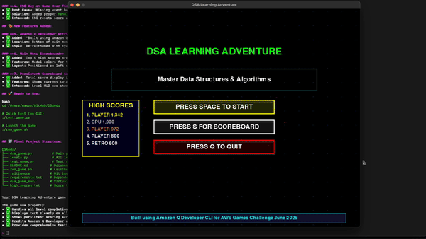

# DSA Learning Adventure

A retro-style educational game built with PyGame to help users learn Data Structures and Algorithms through interactive gameplay.

# 🎮 DSA Learning Adventure

[](https://opensource.org/licenses/MIT)
[](https://www.python.org/downloads/)
[](https://www.pygame.org/)
[](https://aws.amazon.com/)

A retro-style educational game built with PyGame to help users learn Data Structures and Algorithms through interactive gameplay.

## 🎬 **Game Demo Video**



> **🎮 Live animated gameplay showing all 4 DSA levels in action!**
> 
> *30-second preview of actual gameplay footage*

### 📹 **Full HD Video Demo**
**[📥 Download Complete Demo (81MB)](ScreenRecording2025-06-26.mov)** - Full quality video with audio

### 📹 **What You'll See:**
- **🏠 Main Menu**: Retro interface with high scores and Amazon Q attribution
- **🎯 Level Selection**: Interactive DSA challenge selection
- **🔢 Array Level**: Visual linear search demonstration
- **📚 Stack Level**: LIFO operations and sequence building
- **🚶 Queue Level**: FIFO customer processing simulation  
- **🔍 Binary Search**: Divide-and-conquer algorithm visualization
- **🏆 Scoring System**: Points, bonuses, and persistent high scores
- **🎨 Visual Effects**: Retro styling and smooth animations

### 🎮 **Experience Options:**
1. **👆 Watch Above**: Animated preview (1.4MB) loads instantly
2. **📥 Download Full Video**: Click link above for complete HD demo
3. **🎮 Play Interactive**: Run `./run_game.sh` to play yourself
4. **🌐 GitHub Releases**: Professional presentation with release notes

---

## 🎮 Recent Updates & Fixes

### ✅ **Fixed Issues (Latest Version)**
- **Level 2 (Stack)**: Fixed premature completion - now requires building the ENTIRE sequence correctly
- **Level 3 (Queue)**: Fixed crash issues and improved stability with proper error handling
- **Button Text**: Fixed white padding covering button text - all text now clearly visible
- **ESC Key**: Fixed ESC key not working on game over screen
- **Main Menu**: Added high scores preview and Amazon Q Developer attribution

### 🎨 **New Features**
- **Persistent Scoreboard**: Total score visible in all levels (top-right corner)
- **Main Menu Scoreboard**: Preview of top 5 high scores on main screen
- **Amazon Q Attribution**: "Built using Amazon Q Developer CLI for AWS Games Challenge June 2025"
- **Enhanced Stack Level**: Better visual feedback showing sequence matching progress
- **Improved Instructions**: Clearer guidance for each level's objectives

### Current Levels (Playable)
1. **Array Basics** (60s) - Find target elements in arrays
2. **Stack Operations** (45s) - Create sequences using push/pop operations
3. **Queue Management** (45s) - Process customers in FIFO order
4. **Binary Search** (30s) - Find targets using efficient binary search

### Future Levels (Placeholders)
5. **Linked Lists** (40s) - Navigate and manipulate linked structures
6. **Binary Trees** (50s) - Tree traversal and operations
7. **Hash Tables** (35s) - Hash function and collision handling
8. **Graph Traversal** (60s) - BFS and DFS algorithms
9. **Dynamic Programming** (90s) - Optimization problems
10. **Sorting Algorithms** (45s) - Compare different sorting methods

## 🎮 Game Features
- **Retro Aesthetic**: Classic arcade-style graphics and colors
- **Time-based Challenges**: Each level has difficulty-appropriate time limits
- **Scoring System**: Points for correct actions, time bonuses
- **High Score Tracking**: Persistent leaderboard
- **Progressive Difficulty**: Levels get harder as you advance
- **Persistent Scoreboard**: Track total score across all levels
- **Enhanced Graphics**: 3D effects, animations, and visual feedback

## 📚 Documentation

### Complete Documentation Suite
- **[📖 DOCUMENTATION.md](DOCUMENTATION.md)** - Complete project documentation
- **[🔧 API_REFERENCE.md](API_REFERENCE.md)** - Detailed API reference for developers
- **[🤝 CONTRIBUTING.md](CONTRIBUTING.md)** - Guidelines for contributors
- **[📝 CHANGELOG.md](CHANGELOG.md)** - Version history and changes
- **[⚖️ LICENSE](LICENSE)** - MIT License and third-party attributions

### Quick Links
- **Architecture Overview**: See [DOCUMENTATION.md#architecture](DOCUMENTATION.md#architecture)
- **Adding New Levels**: See [CONTRIBUTING.md#adding-new-levels](CONTRIBUTING.md#adding-new-levels)
- **API Reference**: See [API_REFERENCE.md](API_REFERENCE.md)
- **Recent Changes**: See [CHANGELOG.md](CHANGELOG.md)

## 📁 Project Structure

```
DSAedu/
├── 📚 Documentation Suite
│   ├── 📖 README.md              # Project overview (this file)
│   ├── 🔧 DOCUMENTATION.md       # Complete technical documentation
│   ├── 📚 API_REFERENCE.md       # Detailed API reference
│   ├── 🤝 CONTRIBUTING.md        # Contribution guidelines
│   ├── 📝 CHANGELOG.md           # Version history and changes
│   ├── 📋 DOCS_INDEX.md          # Documentation navigation guide
│   └── ⚖️ LICENSE                # MIT License and attributions
├── 🎮 Game Engine
│   ├── 🎯 dsa_game.py            # Main game engine and UI (27KB)
│   ├── 🎲 levels.py              # Level implementations (37KB)
│   └── 🧪 test_game.py           # Test suite for verification
├── 🚀 Distribution & Setup
│   ├── 📄 requirements.txt       # Python dependencies
│   ├── 🚀 run_game.sh           # Easy game launcher
│   ├── 🔧 setup_github_repo.sh  # GitHub repository setup script
│   └── 📋 GITHUB_SETUP.md       # GitHub setup guide
├── 🐙 GitHub Configuration
│   ├── 🙈 .gitignore            # Git ignore rules
│   ├── 📁 .github/
│   │   ├── 📋 ISSUE_TEMPLATE/
│   │   │   ├── bug_report.md    # Bug report template
│   │   │   ├── feature_request.md # Feature request template
│   │   │   └── level_suggestion.md # New level suggestion template
│   │   ├── 🔄 pull_request_template.md # PR template
│   │   └── ⚙️ workflows/
│   │       └── test.yml         # Automated testing workflow
├── 🎬 Media
│   └── 📹 ScreenRecording2025-06-26.mov # Demo video (81MB)
└── 📁 Runtime Files
    ├── 📁 dsa_game_env/         # Virtual environment (auto-created)
    └── 🏆 high_scores.txt       # Score persistence (auto-generated)
```

## 🚀 Quick Setup for GitHub

### Automated Setup
```bash
# Run the automated setup script
./setup_github_repo.sh
```

### Manual Setup
```bash
# 1. Initialize Git and add files
git init
git add .
git commit -m "Initial commit: DSA Learning Adventure v1.0.0"

# 2. Set up for GitHub (replace YOUR_USERNAME)
git remote add origin https://github.com/YOUR_USERNAME/DSAedu.git
git branch -M main
git push -u origin main
```

### For Large Video File (81MB)
```bash
# Install and configure Git LFS
git lfs install
git lfs track "*.mov"
git add .gitattributes
git add ScreenRecording2025-06-26.mov
git commit -m "Add demo video with Git LFS"
git push origin main
```

**📋 Complete Setup Guide**: See [GITHUB_SETUP.md](GITHUB_SETUP.md) for detailed instructions.

## 🚀 Installation

1. **Clone or download this repository**
   ```bash
   git clone <your-repo-url>
   cd DSAedu
   ```

2. **Install Python 3.7+ if not already installed**

3. **Create a virtual environment and install pygame:**
   ```bash
   python3 -m venv dsa_game_env
   source dsa_game_env/bin/activate
   pip install pygame
   ```

### Testing
```bash
# Test game functionality without launching GUI
source dsa_game_env/bin/activate
python3 test_game.py
```

## 🎯 How to Play

### Quick Start
```bash
# Easy way - use the launcher script
./run_game.sh

# Manual way
source dsa_game_env/bin/activate
python3 dsa_game.py
```

### Controls

**Main Menu:**
- `SPACE` - Start game
- `S` - View scoreboard
- `Q` - Quit

**Level Selection:**
- `1-4` - Select available levels
- `ESC` - Return to main menu

**Level-Specific Controls:**

**Array Level:**
- `LEFT/RIGHT` arrows - Navigate array
- `SPACE` - Select current element

**Stack Level:**
- `1-9` - Push number onto stack
- `SPACE` - Pop from stack

**Queue Level:**
- `A` - Add customer to queue
- `SPACE` - Process next customer

**Binary Search Level:**
- `LEFT` - Target is smaller than current middle
- `RIGHT` - Target is larger than current middle
- `SPACE` - Found the target

**Game Over Screen:**
- `R` - Retry current level
- `SPACE` - Return to level select
- `ESC` - Return to main menu

## 🎨 Visual Features

### Enhanced Graphics
- **Animated Backgrounds**: Moving patterns and floating particles
- **3D Button Effects**: Shadows, highlights, and depth
- **Glow Effects**: Animated titles and pulsing elements
- **Visual Feedback**: Immediate responses to player actions

### Level-Specific Enhancements
- **Array Level**: 3D cells with shadows and selection highlighting
- **Stack Level**: Realistic LIFO visualization with operation history
- **Queue Level**: FIFO flow animation with processing area
- **Binary Search**: Search range visualization with efficiency tracking

### UI Improvements
- **Persistent Scoreboard**: Always visible total score in top-right
- **Progress Indicators**: Time bars, efficiency meters, completion tracking
- **Better Contrast**: Improved text visibility and color schemes

## 🎓 Educational Value

This game teaches fundamental DSA concepts through:
- **Visual Learning**: See data structures in action
- **Interactive Practice**: Hands-on manipulation of algorithms
- **Time Pressure**: Simulates coding interview conditions
- **Immediate Feedback**: Learn from mistakes in real-time
- **Progressive Complexity**: Build skills incrementally

### Learning Objectives

**Level 1 - Arrays**: Understanding array indexing and linear search
**Level 2 - Stacks**: LIFO (Last In, First Out) operations
**Level 3 - Queues**: FIFO (First In, First Out) operations  
**Level 4 - Binary Search**: Efficient searching in sorted arrays

## 🔧 Development

### Adding New Levels

To add new levels:

1. Create a new class inheriting from `BaseLevel` in `levels.py`
2. Implement the required methods: `handle_event()`, `update()`, `draw()`
3. Add the level to the factory function `get_level_instance()`
4. Update the level dictionary in `dsa_game.py`

### Code Structure

- **dsa_game.py**: Main game loop, state management, UI rendering
- **levels.py**: Individual level implementations and base class
- **Game States**: Menu, Level Select, Playing, Game Over, Scoreboard

## 🔧 Development

### For Developers
- **[Complete Documentation](DOCUMENTATION.md)**: Architecture, design patterns, and technical details
- **[API Reference](API_REFERENCE.md)**: Detailed class and method documentation
- **[Contributing Guide](CONTRIBUTING.md)**: How to contribute code, levels, and improvements
- **[Testing Guide](CONTRIBUTING.md#testing)**: Unit tests, integration tests, and manual testing

### For Educators
- **[Educational Design](DOCUMENTATION.md#game-design)**: Learning objectives and pedagogical approach
- **[Level Design Guide](CONTRIBUTING.md#adding-new-levels)**: Create custom DSA learning levels
- **[Customization Options](DOCUMENTATION.md#future-enhancements)**: Adapt the game for your curriculum

### For Students
- **[Learning Objectives](DOCUMENTATION.md#educational-goals)**: What you'll learn from each level
- **[Gameplay Strategies](README.md#controls)**: Tips for mastering each level
- **[DSA Concepts](DOCUMENTATION.md#level-design)**: Deep dive into the algorithms and data structures

## 🚀 Future Enhancements

- Sound effects and retro music
- Animation effects for operations
- Multiplayer competitive modes
- More advanced algorithms (graphs, trees, DP)
- Tutorial mode with step-by-step guidance
- Achievement system
- Custom level editor
- Online leaderboards

## 🤝 Contributing

Feel free to contribute by:
- Adding new levels
- Improving existing gameplay
- Enhancing the retro aesthetic
- Adding sound effects
- Optimizing performance
- Fixing bugs
- Improving documentation

## 📝 License

This project is open source. Feel free to use, modify, and distribute.

---

**Enjoy learning DSA the fun way!** 🎮📚
